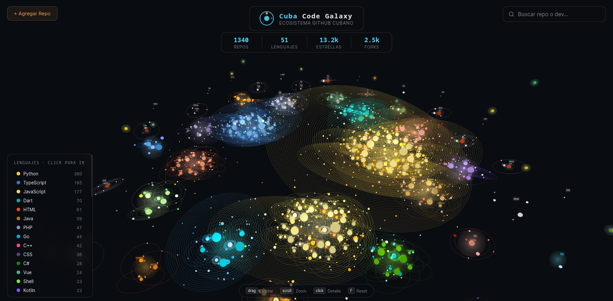

# 🌌 Cuba Code Galaxy


> Visualización 3D interactiva del ecosistema open-source cubano en GitHub

[](https://galaxy.datalis.dev/)
[](https://threejs.org)



## 🎯 ¿Qué es?

Explora **140+ repositorios cubanos** en una galaxia 3D interactiva donde:
- 🌞 **Soles** = Lenguajes (tamaño por cantidad de repos)
- 🪐 **Planetas** = Repos (órbitan el lenguaje; tamaño por ⭐ + 🍴)
- 🌙 **Lunas** = Propietarios (órbitan su repo)
- ⭐ **Asteroides** = Desarrolladores cubanos (perímetro de la galaxia)

## ✨ Características

- **Cero configuración** — Abre directamente en el navegador (sin build, npm, bundler)
- **Interactivo** — Navega, busca, hover para pausar, click para detalles
- **Responsive** — Funciona en desktop, tablet y mobile
- **En Español** — UI completamente localizada
- **20+ lenguajes** y **15+ desarrolladores destacados**

## 🚀 Quick Start

```bash
# Opción 1: Abrir directamente
open cuba-code-galaxy/index.html

# Opción 2: Servidor local (Python)
cd cuba-code-galaxy && python -m http.server 8000

# Opción 3: Node.js
npx http-server cuba-code-galaxy -p 8000
```

Visita: **[galaxy.datalis.dev](https://galaxy.datalis.dev/)**

## 📁 Estructura

```
cuba-code-galaxy/
├── index.html          # App principal (HTML + CSS + JS 850 líneas)
├── cuba-data.js        # Datos estáticos (repos, devs, colores)
├── admin.html          # Panel administrativo
├── devs.html           # Vista de desarrolladores
└── worker/             # Cloudflare Workers (API gateway)
```

## 🏗️ Arquitectura

- **HTML + CSS + JS** en un solo archivo
- **Three.js v0.165.0** vía CDN (sin local copy)
- **Event-driven UI** — Paneles reactivos
- **Raycasting** para selección de objetos (planetas > asteroides > lunas)

### Datos Principales

```javascript
CUBA_REPOS          // 140+ repositorios
CUBAN_DEVS          // 15+ desarrolladores
LANGUAGE_COLORS     // Color por lenguaje
PLANET_PALETTES     // Colores alternos para planetas
REPO_OWNER_MAP      // Mapeo repo → propietario
USER_PROFILES       // Perfiles enriquecidos
```

## 🎮 Cómo Usar

| Acción | Efecto |
|--------|--------|
| **Ratón** | Rota la cámara (click + arrastrar) |
| **Rueda** | Zoom in/out |
| **Hover sol** | Pausa órbitas del sistema |
| **Click** | Muestra detalles en panel |
| **Búsqueda** | Filtra repos y devs en tiempo real |

## 🤝 Contribuir

### Agregar un repositorio

Edita `cuba-data.js`:

```javascript
CUBA_REPOS.push({
  repo: "usuario/repo",
  lang: "TypeScript",
  stars: 100,
  forks: 20,
  pushed: "2026-04-15",
  desc: "Descripción del proyecto"
});
```

### Agregar un desarrollador

```javascript
CUBAN_DEVS.push({
  login: "usuario",
  name: "Nombre Completo",
  followers: 500,
  repos: 15,
  bio: "Breve descripción"
});
```

**Criterios:** Código cubano, público en GitHub, activo, de calidad.

## 🔧 Stack Tecnológico

- **Frontend**: Vanilla JavaScript (ES6 Modules)
- **3D**: Three.js v0.165.0
- **UI**: CSS3 + Custom Properties
- **Tipografía**: Google Fonts (Orbitron, Inter)
- **Hosting**: Vercel / Cloudflare Pages

## 📊 Datos Incluidos

- **TypeScript** (27 repos)
- **Python** (20 repos)
- **Dart/Flutter** (5 apps)
- **Java, Go, Rust, JavaScript** — Y más

### Top Repos

| Repo | ⭐ | Descripción |
|------|----|----|
| yossTheDev/removerized | 632 | AI Image Toolkit |
| covid19cuba/covid19cuba-app | 46 | App COVID-19 |
| atscub/nautapy | 41 | API Nauta |
---

<div align="center">

**¡Explora la galaxia del código cubano! 🌌**

[Abrir →](https://galaxy.datalis.dev/)

</div>
